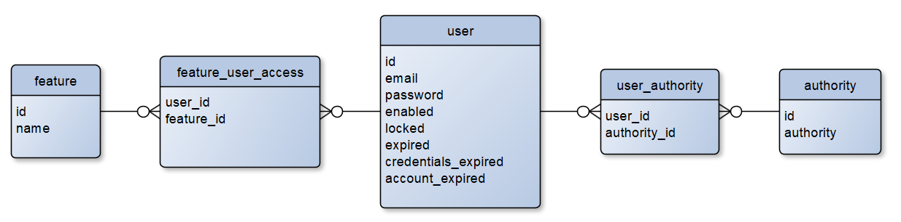

# Feature User Access API
API for Product Managers to manage users’ accesses to features, i.e. enabling/disabling certain feature based on a user’s email and feature names.

## Version: 1.0.0

**Contact information:**  
fletchersarip@gmail.com  

**License:** [Apache 2.0](http://www.apache.org/licenses/LICENSE-2.0.html)

### /feature

#### GET
##### Summary

Get access permission of a user for a feature.

##### Description

By passing in the user's email and feature's name, you can check whether
the user can access the specified feature.

##### Parameters

| Name | Located in | Description | Required | Schema |
| ---- | ---------- | ----------- | -------- | ---- |
| email | query | user's email (case-insensitive) | Yes | string (email) |
| featureName | query | name of the feature (case-insensitive) | Yes | string |

##### Responses

| Code | Description |
| ---- | ----------- |
| 200 | ok, returns user's access permission for the feature |
| 400 | bad input parameter |
| 404 | the specified user or feature cannot be found |
| 500 | internal server error |

#### POST
##### Summary

Configure a user's access for a feature.

##### Description

By passing in a user's email, a feature's name, and a boolean value on whether to give access or not, you can configure the user's access to the specified feature.

##### Responses

| Code | Description |
| ---- | ----------- |
| 200 | ok, user-feature access succesfully configured |
| 304 | not modified |
| 400 | bad input parameter |
| 500 | internal server error |

# Technical Implementation Description
## Spring Boot Components
The API is implemented using Spring Boot with the following main components:
- RestController:
  - FeatureUserAccessRestController
- Service:
  - FeatureUserAccessService
- Repositories:
  - FeatureRepository
  - UserRepository
- Entities:
  - User
  - Feature
  - Authority

## Database Schema
The following image shows the database schema designed for this API.

The feature name, user email, and authority name are all case-insensitive.

Reason for this database schema is to mimic real case scenario, where, before this API is developed, the system already have existing database tables for users with
their credentials and authorities, and for the existing features. The job of the API is then to populate the join table between users and features table that signifies
the user's access permission for the feature. Existence of a row for a certain user and a certain feature signify that the user is allowed access for the feature, whereas
non-existence of the row for a user and a feature signify that there is no access permission between them.

## Security Implementation
The security implemented for the API is:
- Using HTTP Basic Authentication
- JDBC authentication: the user credentials are stored in the embedded H2 database
- Password encoder: BCrypt with 11 rounds

# Demo
## Demo Data
"import.sql" is placed at the "src/main/resources" folder for Hibernate to initialize with the demo data.  
The demo data created in the "import.sql" is as follows:
- Users:
  - fletchersarip@emaildomain.com:
    - password: abc123
    - authorities:
      - product_manager
      - developer
      - user
  - jack@emaildomain.com [abc123] (developer, user)
    - password: abc123
    - authorities:
      - developer
      - user
  - daniel@emaildomain.com [abc123] (developer, user)
    - password: abc123
    - authorities:
      - developer
      - user
  - ben@emaildomain.com [abc123] (developer, user)
    - password: abc123
    - authorities:
      - developer
      - user
- Features:
  - feature-1
  - feature-2
  - feature-3
  - feature-4

Note that the passwords are stored in BCrypt hashed form in the database, hence you won't see the same password shown below in the "import.sql".

Important points:
- Initial state of the demo data will have all users not having access to any of the features (the feature_user_access table is empty).
- Only fletchersarip@emaildomain.com has the "product_manager" authority, which means **only the fletchersarip@emaildomain.com user is authorized to use this API**.

## Demo Instruction
1. Run the Spring Boot application **UserFeatureAccessServiceApplication**.
2. Call the API (both GET and POST) with HTTP Basic Authentication using user with "product_manager" authority, i.e. username = "fletchersarip@emaildomain.com" and password = "abc123"
   (ignore the quotes), expect that the API should work as follows:
   * At first all users should have no access to all features. So doing GET on any user and feature should return canAccess=FALSE.
   * After doing POST to enable features on some users, doing GET on the respective user and feature should then return canAccess=TRUE.
3. Call the API (both GET and POST) with HTTP Basic Authentication using any other user without "product_manager" authority, e.g. username = "ben@emaildomain.com" and password = "abc123"
   (ignore the quotes), expect the API to return 403 Forbidden.